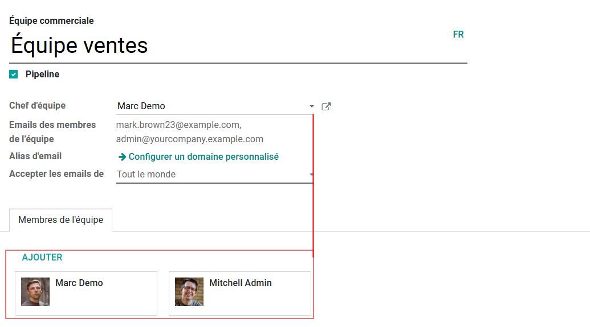

## Description
Ce module contient des changement dans le module CRM ,

## Configuration
Aucune configuration est nécessite,

## Historique:
1) Ajouter un nouveau champs 'emails' dans le module 'crm.team' et calculer tous les emails du membres de l'equipe séparés par des virgules si l'email du membre est existe.

2) Modification de la liste des membres avec la valeur du champs 'user_id' s'il est changé par l’utilisateur.

3) Ajout des nouveaux équipes dans le fichier de données.

4) Configurer les paramètres de manière automatique au moment de l'installation du module.

5) Ajout d'une action automatisè pour envoyer une notification aux membres du l'équipe relier aux opportunités qui sont crées avant 10 jours depuis aujourd'hui.

6) Rendre le champ “Revenu espéré” visible seulement au groupe Administrateur des ventes
7) Le champ d'èquipe dans les opportunités crèes a partir du site web doit remplis par défaut par l’équipe commerciale 'Équipe de vente'.

